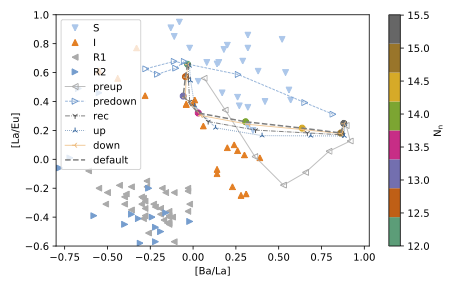

# Snake plots
These notebooks plot three- or four-element plots of one-zone network calculations, and compare them with observations, here the JINAbase compilation. 

The snake-plot notebook allows you to plot any combination of avaialable heavy elements for pre-calculated runs along with additioanl runs done here with changed reaction rates in the constant neutron density equilibrium approximation.

You will be able to make plots like this:

 